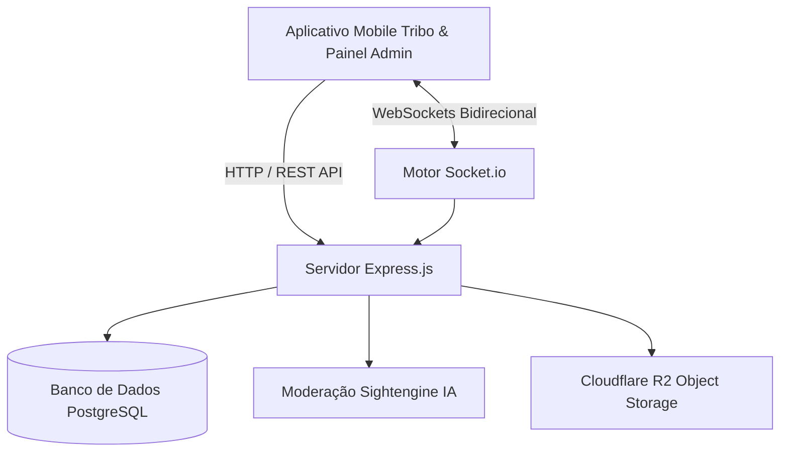

<div align="center">
  

  <br /><br />

  <a href="https://git.io/typing-svg">
    
  </a>

  <p align="center">
    <strong>O Motor Backend de Alta Performance e Baixa Latência da Rede Social Tribo</strong>
  </p>

  <p align="center">
    <a href="https://nodejs.org"></a>
    <a href="https://expressjs.com"></a>
    <a href="https://www.postgresql.org"></a>
    <a href="https://socket.io"></a>
    <a href="https://www.cloudflare.com"></a>
  </p>
</div>

---

### Visão Geral

A **Tribo** é uma rede social focada em conexões autênticas, comunidades interativas (Tribos), streaming contínuo de vídeos curtos (Reels), mensagens privadas em tempo real, aceleração dinâmica de áudio e transmissão de voz ao vivo.

A **Tribo API** fornece toda a infraestrutura central que sustenta o ecossistema:
- **WebSockets de Baixa Latência:** Entrega instantânea de mensagens, status de leitura e eventos do sistema.
- **Algoritmo Autônomo de Reels:** Pipeline de entrega de vídeos com calibração comportamental, tendências de 2026 e fallback resiliente.
- **Moderação Automatizada por IA:** Detecção e bloqueio preventivo de conteúdo sensível (+18) com Sightengine.
- **Controle Global da Plataforma:** Sistema dinâmico de suspensão por Manutenção ou Ordem Legal com liberação exclusiva para a administração mestre.

---

### Módulos Principais & Arquitetura

<table>
  <tr>
    <td width="50%">
      <h4>Comunicação em Tempo Real</h4>
      <ul>
        <li>Chat direto (1-a-1) e canais comunitários de Tribos.</li>
        <li>Aceleração dinâmica de áudio (<strong>1x até 5x</strong>).</li>
        <li>Figurinhas em vídeo com volume espacializado e auto-pause.</li>
        <li>Salas de transmissão de voz ao vivo integradas (<em>Live Voice</em>).</li>
        <li>Badges e contadores de mensagens não lidas em tempo real.</li>
      </ul>
    </td>
    <td width="50%">
      <h4>Feed de Reels Personalizado</h4>
      <ul>
        <li>Pipeline de distribuição de vídeos verticais em tela cheia.</li>
        <li>Buscador autônomo de tendências e memes atualizados de 2026.</li>
        <li>Calibração de preferências por texto livre e afinidade de categorias.</li>
        <li>Mecanismo de fallback contra limites de requisições externas.</li>
      </ul>
    </td>
  </tr>
  <tr>
    <td width="50%">
      <h4>Moderação Visual por IA</h4>
      <ul>
        <li>Classificação visual de imagens e vídeos via Sightengine API.</li>
        <li>Bloqueio preventivo de mídia com violação de diretrizes (+18).</li>
        <li>Painel centralizado de denúncias, advertências e banimentos.</li>
      </ul>
    </td>
    <td width="50%">
      <h4>Governança e Suspensão da Plataforma</h4>
      <ul>
        <li>Transição dinâmica de estados (<code>ACTIVE</code>, <code>MAINTENANCE</code>, <code>LEGAL_ORDER</code>).</li>
        <li>Broadcast instantâneo via WebSocket bloqueando clientes conectados.</li>
        <li>Bypass vitalício e irrestrito para o administrador mestre.</li>
      </ul>
    </td>
  </tr>
</table>

---

### Fluxo de Arquitetura



- **Ambiente de Execução:** Node.js (v18+)
- **Framework Web:** Express.js
- **Banco de Dados:** PostgreSQL (`postgres.js` / Supabase / Neon)
- **Comunicação em Tempo Real:** Socket.io
- **Segurança e Criptografia:** JWT (JSON Web Tokens) & Bcrypt
- **Mídia e CDN:** Cloudflare R2 / AWS S3 SDK
- **Inteligência de Moderação:** Sightengine Computer Vision API

---

### Instalação e Execução

#### 1. Clonar o Repositório
```bash
git clone https://github.com/luan-Silva-Dev-0fc/tribo-api.git
cd tribo-api
```

#### 2. Instalar Dependências
```bash
npm install
```

#### 3. Configurar Variáveis de Ambiente
Copie o modelo e preencha com suas configurações:
```bash
cp .env.example .env
```

#### 4. Iniciar o Servidor
```bash
# Modo de Desenvolvimento (Hot Reload)
npm run dev

# Modo de Produção
npm start
```

O servidor estará disponível por padrão em `http://localhost:3000`.

---

### Estrutura do Projeto

```
tribo-api/
├── src/
│   ├── config/          # Conexões com banco de dados e variáveis de ambiente
│   ├── controllers/     # Controladores das regras de negócio (Auth, Reels, Admin, Posts)
│   ├── middlewares/     # Validação de tokens, rate limiting e suspensão global
│   ├── models/          # Modelos SQL e consultas ao banco
│   ├── routes/          # Definição das rotas RESTful
│   ├── services/        # Serviços auxiliares (JWT, Sightengine, Reels, Storage)
│   ├── sockets/         # Handlers de WebSockets (Chat, Notificações, Voz)
│   ├── utils/           # Formatadores, validadores e registros de log
│   ├── app.js           # Inicialização da aplicação Express e middlewares
│   └── server.js        # Bootstrap dos servidores HTTP e Socket.io
├── .env.example
├── .gitignore
├── README.md
└── package.json
```

---

<div align="center">
  <sub>Desenvolvido por <strong><a href="https://github.com/luan-Silva-Dev-0fc">Luan Silva</a></strong> para a Comunidade Tribo.</sub>
</div>
