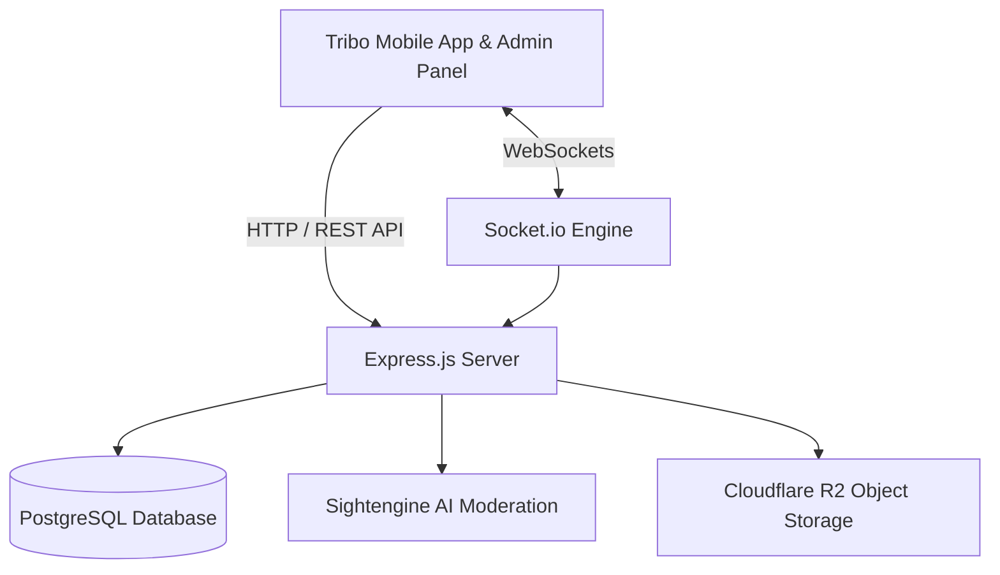

<div align="center">
  

  <br /><br />

  <a href="https://git.io/typing-svg">
    
  </a>

  <p align="center">
    <strong>The High-Performance Real-Time Backend Engine for the Tribo Social Network</strong>
  </p>

  <p align="center">
    <a href="https://nodejs.org"></a>
    <a href="https://expressjs.com"></a>
    <a href="https://www.postgresql.org"></a>
    <a href="https://socket.io"></a>
    <a href="https://www.cloudflare.com"></a>
  </p>
</div>

---

### Overview

**Tribo** is an authentic connection platform designed for active communities, customized short-form video streaming (Reels), spatial audio chat with multi-speed playback, and real-time interactive messaging.

**Tribo API** delivers the mission-critical infrastructure that powers the network:
- **Zero-Latency WebSockets:** Real-time event propagation, instant status broadcasting, and voice channels.
- **Autonomous Reels Engine:** Algorithm continuously tuned for viral content, trending memes, and dynamic preference prompts.
- **Sightengine Computer Vision:** Automated multi-layer image and video moderation for explicit content detection.
- **Global Platform Control:** Dynamic maintenance and legal compliance suspension system with strict master administrator bypass.

---

### Core Architecture & Modules

<table>
  <tr>
    <td width="50%">
      <h4>Real-Time Communication</h4>
      <ul>
        <li>Direct 1-on-1 private messaging and Tribo community channels.</li>
        <li>Dynamic audio playback acceleration (<strong>1x up to 5x</strong>).</li>
        <li>Video stickers with viewport-based spatial volume and auto-pause.</li>
        <li>Integrated live audio broadcast rooms (<em>Live Voice</em>).</li>
        <li>Real-time unread message badges and instant read receipts.</li>
      </ul>
    </td>
    <td width="50%">
      <h4>Personalized Reels Feed</h4>
      <ul>
        <li>Vertical short-form video delivery pipeline.</li>
        <li>Autonomous query engine for current year viral trends.</li>
        <li>Natural language preference calibrator and interest clustering.</li>
        <li>Instant fallback scrapers ensuring zero rate-limit downtime.</li>
      </ul>
    </td>
  </tr>
  <tr>
    <td width="50%">
      <h4>Automated AI Moderation</h4>
      <ul>
        <li>Real-time Sightengine visual content classification.</li>
        <li>Automatic filtering of sensitive and policy-violating media.</li>
        <li>Centralized report handling, warnings, and suspension logging.</li>
      </ul>
    </td>
    <td width="50%">
      <h4>Platform Governance & Security</h4>
      <ul>
        <li>Real-time state transitions (<code>ACTIVE</code>, <code>MAINTENANCE</code>, <code>LEGAL_ORDER</code>).</li>
        <li>Instant WebSocket broadcast shutting down client navigation when activated.</li>
        <li>Dedicated master authentication bypass for platform administration.</li>
      </ul>
    </td>
  </tr>
</table>

---

### Tech Stack



- **Runtime Environment:** Node.js (v18+)
- **Application Framework:** Express.js
- **Persistence Layer:** PostgreSQL (`postgres.js` / Supabase / Neon)
- **Real-Time Layer:** Socket.io
- **Security & Hashing:** JWT (JSON Web Tokens) & Bcrypt
- **Media & CDN:** Cloudflare R2 / AWS S3 SDK
- **AI & Safety:** Sightengine Vision Moderation API

---

### Installation & Deployment

#### 1. Clone Repository
```bash
git clone https://github.com/luan-Silva-Dev-0fc/tribo-api.git
cd tribo-api
```

#### 2. Install Dependencies
```bash
npm install
```

#### 3. Environment Setup
```bash
cp .env.example .env
```

#### 4. Run Server
```bash
# Development Mode (Hot Reload)
npm run dev

# Production Mode
npm start
```

The API service runs on `http://localhost:3000` by default.

---

### Project Structure

```
tribo-api/
├── src/
│   ├── config/          # Database, environmental and Firebase bindings
│   ├── controllers/     # Business logic handlers (Auth, Reels, Admin, Posts)
│   ├── middlewares/     # Auth verification, rate limits, platform suspension
│   ├── models/          # SQL database schemas and data models
│   ├── routes/          # RESTful routing declarations
│   ├── services/        # Auxiliary services (JWT, Sightengine, Reels, Storage)
│   ├── sockets/         # WebSocket handlers (Chat, Notifications, Voice)
│   ├── utils/           # Shared helpers, formatters, and loggers
│   ├── app.js           # Express app setup and middleware chain
│   └── server.js        # HTTP and Socket.io server bootstrap
├── .env.example
├── .gitignore
├── README.md
└── package.json
```

---

<div align="center">
  <sub>Developed by <strong><a href="https://github.com/luan-Silva-Dev-0fc">Luan Silva</a></strong> for the Tribo Community.</sub>
</div>
