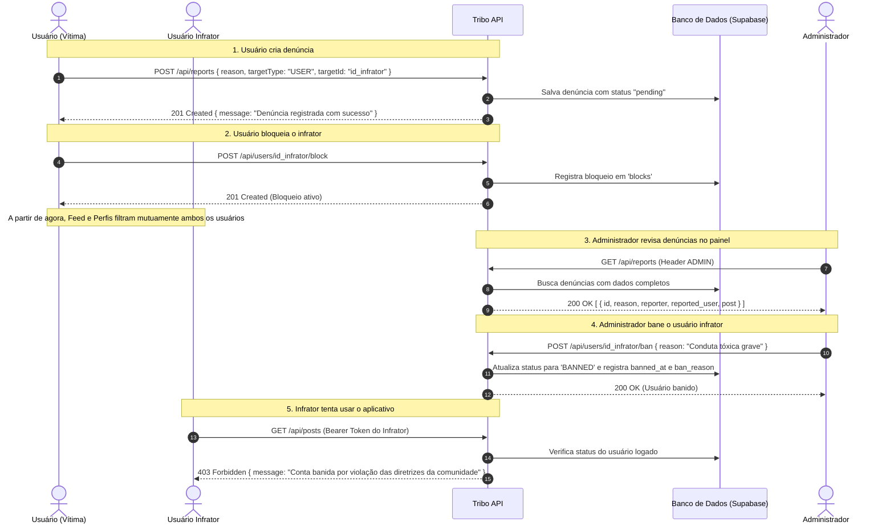

# Documentação da API - Tribo

Guia completo e referência dos endpoints de **Moderação, Denúncias, Bloqueios e Banimentos**, além do fluxo operacional do sistema de segurança e integridade da rede social Tribo.

---

## 1. Visão Geral de Permissões e Autenticação

A API utiliza tokens **JWT (JSON Web Token)** no cabeçalho de todas as requisições autenticadas:
```http
Authorization: Bearer <seu_token_jwt>
```

### Níveis de Permissão:
- **Público**: Acesso sem necessidade de autenticação (ex: `/api/login`, `/api/register`, `/health`).
- **Usuário Autenticado**: Requer token válido e usuário com `status === 'ACTIVE'`.
- **ADMIN**: Requer token válido, usuário com `status === 'ACTIVE'` e campo `role === 'ADMIN'` no banco de dados.

### Verificação de Banimento no Middleware JWT:
Em qualquer rota autenticada, o middleware consulta o status do usuário em tempo real no banco de dados:
- Se o usuário estiver com `status === 'BANNED'`, a requisição é **imediatamente rejeitada** com **HTTP 403 Forbidden** e a seguinte estrutura de resposta:
```json
{
  "message": "Conta banida por violação das diretrizes da comunidade",
  "bannedAt": "2026-08-03T14:30:00.000Z",
  "banReason": "Violação recorrente das diretrizes da comunidade"
}
```

---

## 2. Regra de Bloqueio Bidirecional (Feed, Perfis e Posts)

Para garantir privacidade e segurança:
- Quando o **Usuário A bloqueia o Usuário B**:
  - Usuário A **não vê** posts, comentários ou o perfil do Usuário B.
  - Usuário B **não vê** posts, comentários ou o perfil do Usuário A.
- O filtro é aplicado automaticamente em:
  - `GET /api/posts` (Feed de postagens)
  - `GET /api/posts/:id` (Busca de post específico)
  - `GET /api/users` (Listagem de perfis)
  - `GET /api/users/:id` (Perfil do usuário)
  - `GET /api/users/suggestions` (Sugestões de perfis)

---

## 3. Endpoints de Denúncias (Reports)

### 3.1. Criar Denúncia
- **Método**: `POST`
- **Rota**: `/api/reports`
- **Permissão**: `Usuário Autenticado`
- **Headers**: `Authorization: Bearer <token>`
- **Corpo da Requisição (JSON)**:
```json
{
  "reason": "Discurso de ódio e conduta abusiva",
  "targetType": "USER",
  "targetId": "62bb2e37-44f8-4330-9011-bb06fe4d9006"
}
```
> **Valores aceitos em `targetType`**: `USER`, `POST`, `COMMENT`.  
> Em `targetType: "POST"`, você também pode usar a rota direta `POST /api/posts/:id/report` com corpo `{ "reason": "..." }`.

- **Códigos de Resposta**:
  - `201 Created`: Denúncia registrada com sucesso.
  - `400 Bad Request`: Motivo (`reason`) ou identificador do alvo (`targetId`) ausente.
  - `401 Unauthorized`: Token ausente ou inválido.
  - `403 Forbidden`: Conta do usuário banida.

- **Exemplo de Resposta (201)**:
```json
{
  "message": "Denúncia registrada com sucesso",
  "report": {
    "id": "c1f7278d-9654-46f3-93d3-9bc58db09458",
    "reporter_id": "8f8b89e2-6320-410a-bd63-9d0b00c920f7",
    "reported_user_id": "62bb2e37-44f8-4330-9011-bb06fe4d9006",
    "post_id": null,
    "reason": "Discurso de ódio e conduta abusiva",
    "status": "pending",
    "created_at": "2026-08-03T14:35:00.000Z"
  }
}
```

---

### 3.2. Listar Todas as Denúncias (Painel Administrativo)
- **Método**: `GET`
- **Rota**: `/api/reports`
- **Permissão**: `ADMIN`
- **Headers**: `Authorization: Bearer <token_admin>`
- **Códigos de Resposta**:
  - `200 OK`: Lista completa de denúncias detalhadas com dados de denunciante, denunciado e conteúdo.
  - `401 Unauthorized`: Token ausente ou inválido.
  - `403 Forbidden`: Usuário não possui privilégios de administrador (`role !== 'ADMIN'`).

- **Exemplo de Resposta (200)**:
```json
[
  {
    "id": "c1f7278d-9654-46f3-93d3-9bc58db09458",
    "reason": "Discurso de ódio e conduta abusiva",
    "status": "pending",
    "created_at": "2026-08-03T14:35:00.000Z",
    "reporter_id": "8f8b89e2-6320-410a-bd63-9d0b00c920f7",
    "reported_user_id": "62bb2e37-44f8-4330-9011-bb06fe4d9006",
    "post_id": null,
    "reporter": {
      "id": "8f8b89e2-6320-410a-bd63-9d0b00c920f7",
      "name": "Maria Silva",
      "username": "mariasilva",
      "email": "maria@exemplo.com",
      "avatar_url": "https://pub-42c1a5dd1d8e4de4946a82f2fa559aa2.r2.dev/profiles/avatar-maria.jpg"
    },
    "reported_user": {
      "id": "62bb2e37-44f8-4330-9011-bb06fe4d9006",
      "name": "Usuário Infrator",
      "username": "infrator123",
      "email": "infrator@exemplo.com",
      "avatar_url": null,
      "status": "ACTIVE"
    },
    "post": null
  }
]
```

---

### 3.3. Consultar Denúncia por ID
- **Método**: `GET`
- **Rota**: `/api/reports/:id`
- **Permissão**: `ADMIN` ou o `Usuário Denunciante`
- **Códigos de Resposta**:
  - `200 OK`: Dados da denúncia.
  - `403 Forbidden`: Sem permissão para visualizar a denúncia.
  - `404 Not Found`: Denúncia não encontrada.

---

### 3.4. Atualizar Status da Denúncia
- **Método**: `PUT`
- **Rota**: `/api/reports/:id`
- **Permissão**: `ADMIN` (para status) ou `Usuário Denunciante` (para motivo)
- **Corpo da Requisição (JSON)**:
```json
{
  "status": "resolved"
}
```
- **Códigos de Resposta**:
  - `200 OK`: Denúncia atualizada.
  - `403 Forbidden`: Sem permissão.
  - `404 Not Found`: Denúncia não encontrada.

---

## 4. Endpoints de Bloqueio (Blocks)

### 4.1. Bloquear Usuário
- **Método**: `POST`
- **Rota**: `/api/users/:userId/block`
- **Permissão**: `Usuário Autenticado`
- **Headers**: `Authorization: Bearer <token>`
- **Códigos de Resposta**:
  - `201 Created`: Usuário bloqueado com sucesso.
  - `400 Bad Request`: Tentativa de auto-bloqueio (`userId === req.user.sub`).
  - `409 Conflict`: Usuário já se encontra bloqueado.

---

### 4.2. Desbloquear Usuário
- **Método**: `DELETE`
- **Rota**: `/api/users/:userId/block`
- **Permissão**: `Usuário Autenticado`
- **Headers**: `Authorization: Bearer <token>`
- **Códigos de Resposta**:
  - `204 No Content`: Desbloqueio realizado com sucesso.
  - `404 Not Found`: Bloqueio não encontrado.

---

### 4.3. Listar Usuários Bloqueados
- **Método**: `GET`
- **Rota**: `/api/users/blocks`
- **Permissão**: `Usuário Autenticado`
- **Headers**: `Authorization: Bearer <token>`
- **Códigos de Resposta**:
  - `200 OK`: Retorna a lista de bloqueios criados pelo usuário.

---

## 5. Endpoints de Banimento e Moderação de Status

### 5.1. Banir Usuário
- **Método**: `POST`
- **Rota**: `/api/users/:id/ban`
- **Permissão**: `ADMIN`
- **Headers**: `Authorization: Bearer <token_admin>`
- **Corpo da Requisição (JSON)**:
```json
{
  "reason": "Violação recorrente dos termos de uso da comunidade"
}
```
- **Códigos de Resposta**:
  - `200 OK`: Usuário banido com sucesso.
  - `403 Forbidden`: Apenas administradores podem executar esta ação.
  - `404 Not Found`: Usuário não encontrado.

- **Exemplo de Resposta (200)**:
```json
{
  "id": "62bb2e37-44f8-4330-9011-bb06fe4d9006",
  "username": "infrator123",
  "status": "BANNED",
  "role": "USER",
  "banned_at": "2026-08-03T14:35:00.000Z",
  "ban_reason": "Violação recorrente dos termos de uso da comunidade"
}
```

---

### 5.2. Desbanir / Reativar Usuário
- **Método**: `DELETE`
- **Rota**: `/api/users/:id/ban`
- **Permissão**: `ADMIN`
- **Headers**: `Authorization: Bearer <token_admin>`
- **Códigos de Resposta**:
  - `200 OK`: Usuário reativado (`status: 'ACTIVE'`).
  - `403 Forbidden`: Acesso restrito a administradores.

---

### 5.3. Alterar Status Geral do Usuário
- **Método**: `PUT`
- **Rota**: `/api/users/:id/status`
- **Permissão**: `ADMIN`
- **Headers**: `Authorization: Bearer <token_admin>`
- **Corpo da Requisição (JSON)**:
```json
{
  "status": "ACTIVE | SUSPENDED | BANNED",
  "reason": "Justificativa da ação administrativa"
}
```
- **Códigos de Resposta**:
  - `200 OK`: Status atualizado.
  - `400 Bad Request`: Status inválido.
  - `403 Forbidden`: Acesso restrito a administradores.

---

## 6. Fluxo Completo de Moderação e Segurança

Abaixo está o ciclo de vida completo de uma ação de moderação:



---

## 7. Mensagens Diretas (Direct Messages), Edição e Exclusão

### 7.1. Editar Mensagem
- **Método**: `PUT` ou `PATCH`
- **Rota**: `/api/messages/:id`
- **Permissão**: `Usuário Autenticado (Apenas o autor da mensagem)`
- **Headers**: `Authorization: Bearer <token>`
- **Corpo da Requisição (JSON)**:
```json
{
  "content": "Conteúdo corrigido da mensagem"
}
```
- **Códigos de Resposta**:
  - `200 OK`: Mensagem editada com sucesso.
  - `400 Bad Request`: Conteúdo vazio ou mensagem apagada para todos.
  - `403 Forbidden`: Usuário não é o autor da mensagem.
  - `404 Not Found`: Mensagem não encontrada.
- **Exemplo de Resposta (200)**:
```json
{
  "message": "Mensagem editada com sucesso",
  "isEdited": true,
  "is_edited": true,
  "editedAt": "2026-08-05T20:31:13.387Z",
  "direct_message": {
    "id": "082f80ce-4824-472c-aa8f-d1f23cab45fd",
    "sender_id": "705eaac4-e1f2-4bf1-a2aa-38ea783a026b",
    "receiver_id": "62bb2e37-44f8-4330-9011-bb06fe4d9006",
    "content": "Conteúdo corrigido da mensagem",
    "is_edited": true,
    "edited_at": "2026-08-05T20:31:13.387Z",
    "is_deleted": false,
    "deleted_for_everyone": false
  }
}
```

---

### 7.2. Excluir Mensagem ("Para Todos" ou "Para Mim")
- **Método**: `DELETE`
- **Rota**: `/api/messages/:id` (ou `/api/messages/:id?type=everyone` / `/api/messages/:id?type=me`)
- **Permissão**: `Usuário Autenticado`
- **Headers**: `Authorization: Bearer <token>`
- **Corpo da Requisição (Opcional JSON)**:
```json
{
  "type": "everyone" // ou "me"
}
```
> **Tipos de Exclusão**:
> - `"everyone"` / `forEveryone: true`: Soft delete para todos os participantes (Apenas o autor pode executar). A mensagem é substituída pelo texto `"Esta mensagem foi apagada"`.
> - `"me"` / `forMe: true`: Exclui a mensagem apenas para o usuário logado (removida do seu histórico), permanecendo visível para o outro contato.

- **Exemplo de Resposta - Para Todos (200)**:
```json
{
  "message": "Mensagem apagada para todos",
  "deletedForEveryone": true,
  "deleted_for_everyone": true,
  "isDeleted": true,
  "is_deleted": true,
  "direct_message": {
    "id": "082f80ce-4824-472c-aa8f-d1f23cab45fd",
    "content": "Esta mensagem foi apagada",
    "is_deleted": true,
    "deleted_for_everyone": true,
    "deleted_at": "2026-08-05T20:31:15.139Z"
  }
}
```

- **Exemplo de Resposta - Para Mim (200)**:
```json
{
  "message": "Mensagem apagada para você",
  "deletedForMe": true,
  "deleted_for_me": true,
  "id": "2cfc4879-55e6-4d28-a5f4-b2269ac21087"
}
```

---

### 7.3. Marcar Mensagens como Lidas
- **Método**: `PUT` ou `PATCH`
- **Rota**: `/api/messages/read` (ou `/api/messages/:id/read`)
- **Permissão**: `Usuário Autenticado`
- **Headers**: `Authorization: Bearer <token>`
- **Corpo da Requisição (JSON para marcação em lote)**:
```json
{
  "senderId": "705eaac4-e1f2-4bf1-a2aa-38ea783a026b"
}
```
- **Exemplo de Resposta (200)**:
```json
{
  "message": "Mensagens marcadas como lidas",
  "count": 2,
  "updated_messages": [ ... ]
}
```

---

## 8. Configurações de Privacidade do Usuário (Settings)

### 8.1. Obter Configurações
- **Método**: `GET`
- **Rota**: `/api/user/settings` ou `/api/users/settings`
- **Permissão**: `Usuário Autenticado`
- **Exemplo de Resposta (200)**:
```json
{
  "showOnlineStatus": true,
  "show_online_status": true,
  "readReceipts": true,
  "read_receipts": true,
  "isPrivate": false,
  "is_private": false
}
```

---

### 8.2. Atualizar Preferências de Privacidade
- **Método**: `PATCH` ou `PUT`
- **Rota**: `/api/user/settings` ou `/api/users/settings`
- **Permissão**: `Usuário Autenticado`
- **Corpo da Requisição (JSON)**:
```json
{
  "showOnlineStatus": false,
  "readReceipts": false,
  "isPrivate": false
}
```
- **Exemplo de Resposta (200)**:
```json
{
  "message": "Configurações atualizadas com sucesso",
  "showOnlineStatus": false,
  "show_online_status": false,
  "readReceipts": false,
  "read_receipts": false,
  "isPrivate": false,
  "is_private": false
}
```

---

### 8.3. Regras de Privacidade Aplicadas

1. **Status Online (`showOnlineStatus`)**:
   - Se `showOnlineStatus === false`:
     - O perfil consultado por outros usuários (`GET /api/users/:id`, `GET /api/users`, `GET /api/messages/conversations`) retornará `isOnline: null` e `lastSeen: null`.
     - O usuário que desativa seu status online também não visualiza o status online de terceiros (comportamento padrão de privacidade).

2. **Confirmação de Leitura (`readReceipts`)**:
   - Se `readReceipts === false`:
     - O remetente da mensagem não recebe o timestamp de leitura (`readAt: null`, `isRead: false`).
     - O usuário que desativa confirmações de leitura também não vê as confirmações de leitura enviadas pelos outros.

